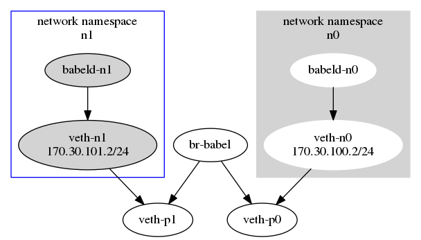

# babeld-lab
virtual network lab for babeld experiments

The purpose of this project is to setup a virtual babel mesh for educational and testing purposes purposes. 

*this is a work in progress*

# requirements
1. a linux of sorts
1. [git](https://git-scm.com) (using ```sudo apt-get install git``` perhaps)
1. [babeld](https://github.com/jech/babeld)
1. [wireshark](https://wireshark.org)
1. access to tools [ip](http://man7.org/linux/man-pages/man8/ip.8.html) and [brctl](https://linux.die.net/man/8/brctl) (using ```sudo apt-get install bridge-utils``` perhaps) 

# building a virtual two node babel mesh
To build an experimental setup that connects (virtual) babel nodes without having to mess around with physical hardware, various techniques can be used. One of them is using linux's veth, brctr, and ip to create virtual network interfaces and bridges and (optionally) isolate them using namespaces. 

[Docker](https://docker.com) is using similar techniques (network namespaces) under the hood to configure network interfaces. Docker provides much more functionality, but for our intended purposes, we don't need to full-blown docker containers to demonstrate how babeld works.

We're trying to build something like:

[](./diagram.png)

# step 0: clone this repository

```git clone https://github.com/jhpoelen/babeld-lab.git```

# step 1: add interfaces
this adds interfaces

```
sudo ./babeld-lab.sh add
```
verify that ```ip addr``` now contains br-babel and veth-p0/p1.
also verify that ```sudo ip netns exec n0 ip addr``` contains veth-n0 and ```sudo ip netns exec n1 ip addr``` contains veth-n0. The state of all interfaces should be down.

# step 2: turn interfaces on
```
sudo ./babeld-lab.sh up
```
verify that the ```ip addr``` cmds of step 1 now indicate that the interfaces are up.

# step 3: start babeld's
```
sudo ./babeld-lab.sh start
```
Log and process id files for started babel nodes should now be created (e.g. ```babel0.log```, ```babel0.pid```).

Verify that ```sudo ip netns exec n0 ip route``` contains something like:
```
170.30.101.2 via 170.30.101.2 dev veth-n0  proto babel onlink
``` 
and that the ```sudo ip netns exec n1 ip route``` contains something like:
```
170.30.100.2 via 170.30.100.2 dev veth-n1  proto babel onlink 
```

# step 4: monitor babel toggle bridge
To monitor the babel chatter, start wireshark and select br-babel interface: you should see babel hello and babel ihu (I hear you) messages going back and forth.

When disabling the bridge (similar to unplugging nodes from a network switch), using something like ```sudo ./babeld-lab.sh down_bridge```, the routing tables of n0 and n1 network namespaces should clear out, and traffic should stop.

You can monitor the node logs (e.g. ```babel0.log```) and you'll notice the routes aging and eventually being removed. This might process might take a minute or two.

After the route expired, the ```sudo ip netns exec n0 ip route``` should no longer contain entry like ```170.30.101.2 via 170.30.101.2 dev veth-n0  proto babel onlink```.  

Enabling using ```sudo ./babeld-lab.sh up_bridge``` should restart the network, reintroduce the chatter and re-establish the routes.

# step 5: stop and delete the network 
After doing the experiments, stop babeld ```sudo ./babeld-lab.sh stop```, stop the interfaces/bridge and delete the virtual network interfaces ```sudo sh babeld-lab.sh down```, delete the network interfaces/bridge ```sudo ./babeld-lab delete```


